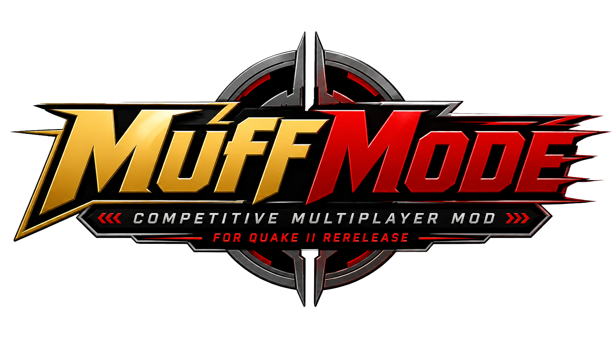

  

  
  
  
  
  

  <h1>Muff Mode</h1>
  
<strong>Server-side multiplayer upgrades for Quake II Remastered.</strong>

Muff Mode is a server-side multiplayer mod for [Quake II Remastered](https://github.com/id-Software/quake2-rerelease-dll). It is built for casual public games, competitive matches, and the hosts who keep those servers running: easier menus for players, cleaner match flow for organized play, and practical controls for server owners.

## Who It's For

| Audience | What Muff Mode gives you |
| --- | --- |
| Casual players | Clearer HUD information, menu-driven voting, approachable team joining, and extra modes such as Horde, Instagib, and NadeFest. |
| Competitive players | Ready-up flow, countdowns, overtime, timeouts, Duel/TDM/CA support, rulesets, captain controls, and cleaner match administration. |
| Server hosts | Per-gametype configs, map rotations and pools, voting limits, admin commands, team controls, debug logging, and diagnostics. |

## Start Here

| I want to... | Read |
| --- | --- |
| Install, join games, vote, bind the hook, or learn player commands | [Player Guide](docs/player-guide.md) |
| Run a public server, private lobby, pickup, or scrim server | [Server Host Guide](docs/server-host-guide.md) |
| Compare gametypes, game modifications, maps, and rulesets | [Gameplay Reference](docs/gameplay-reference.md) |
| Look up commands, cvars, voting flags, and config files | [Configuration Reference](docs/configuration-reference.md) |
| Build maps or entity overrides for Muff Mode | [Level Design Guide](docs/level-design-guide.md) |
| Build or publish the Windows updater | [Updater Guide](docs/updater-guide.md) |
| Compile the DLL from source | [Build Guide](docs/build-guide.md) |
| Prepare and publish a release package | [Release Process](docs/release-process.md) |

## Quick Install

1. Download the [latest Muff Mode release](https://github.com/DarkMatter-Productions/MuffMode/releases/latest).
2. Use the Windows installer when available. It defaults to the Steam Quake II Remastered path and also offers Epic Online Store / Epic Games Store, GOG, and custom library choices.
3. If you use the zip instead, extract it into the outer `Quake 2` folder and allow file replacements.
4. Launch the game normally. Server hosts can execute the bundled server config with `exec muff-sv.cfg` when it is included in the release package.

For a more careful walkthrough, use the [Player Guide](docs/player-guide.md) or [Server Host Guide](docs/server-host-guide.md).

## Highlights

- Clearer HUD and scoreboard information for public games and competitive matches.
- Menu-driven voting for maps, gametypes, rulesets, settings, and administrative actions.
- Match handling for warmups, ready checks, countdowns, post-match delays, sudden death, overtime, and round-based modes.
- Team captain support, team locking, auto-balance options, forced-balance rules, and team item-drop notices.
- New and expanded gametypes, including Duel, Clan Arena, CaptureStrike, Red Rover, Horde, Freeze Tag, ProBall, Instagib, and NadeFest.
- Rulesets inspired by Quake II rerelease, Muff Mode balance, Quake III Arena, Quake, and Quake Champions.
- Player conveniences such as kill beeps, configurable frag messages, EyeCam spectating, offhand hook support, MyMap queueing, and improved vote access.
- Host controls for per-gametype configs, map pools, votable gametype and ruleset lists, debug logging, MOTD files, and diagnostics.
- Level-designer controls for conditional entity spawning, item replacement, `.ent` overrides, new target entities, new item types, and map-specific tweaks.

## Included Content

Muff Mode releases are intended to include the game logic DLL, server configuration material, bot support files, and map entity overrides. The source repository contains the C++ game code, project files, docs, and image assets used by the project.

## Development

The project builds on Windows with Visual Studio 2022/MSBuild. See the [Build Guide](docs/build-guide.md) for prerequisites, commands, output location, and local test installation.

## Roadmap

- Extend MyMap support for deathmatch flags.
- Continue Freeze Tag refinements.
- Explore server-side player configs, stats, Elo, ranked matches, and Elo team balancing.
- Continue Gladiator bot work.
- Keep improving the menu, voting, admin, MyMap, and player configuration flows.

## Credits

Muff Mode exists thanks to the Quake II Sanctuary community, the Nightdive team, id Software, the Quake II rerelease player community, [Paril's Q2 Horde work](https://github.com/Paril/q2horde), ceeeKay's EyeCam code from Q2Eaks, and the Stingy Hat Games modding tutorials.

See [LICENSE](LICENSE) for license details.
