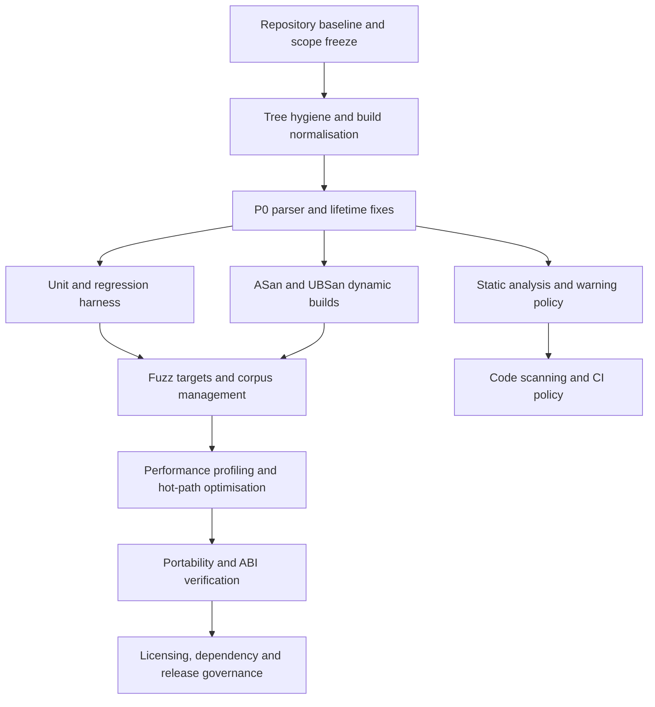
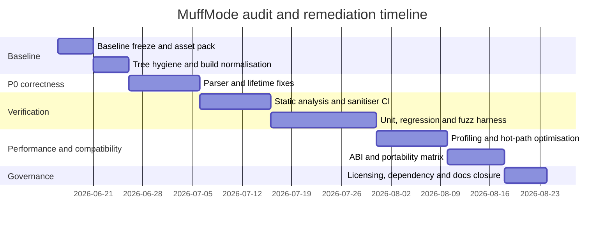

# Full Health Audit and Improvement Plan for DarkMatter-Productions/MuffMode

## Executive summary

MuffMode is not a “legacy C code dump”; it is a fairly modernised Quake II Rerelease game-module codebase with C++ wrappers, compile-time save metadata, pinned package versions via `vcpkg.json`, GitHub Actions release automation, and explicit integrity checks around shared game/server structures. The upstream rerelease API itself is substantially different from original Quake II: it uses a newer game/server interface, a thin client-game module, C++17/C++20, JSON save/load callbacks, and strict shared-structure compatibility requirements between engine and game DLL. That gives MuffMode a strong foundation, but it also raises the bar for ABI discipline, regression control, and automated verification. citeturn36search0turn13view0turn44view0turn16view9

The highest-priority problems I found are concrete and actionable. The most serious is in server command IP parsing: `StringToFilter` accumulates digits into `char num[128]` without a bounds check and then reinterprets `byte[4]` storage as `unsigned`, which is both a memory-safety surface and undefined behaviour. Client/admin command parsing also uses `atoi`/`atof` and has argument-count contracts that are too weak: `Cmd_Teleport_f` checks `argc() < 4` but then reads optional angle arguments under `argc() >= 4`, and `Cmd_Spawn_f` walks key/value pairs without validating an even count. These are P0 correctness and robustness issues because they sit on externally supplied command input. citeturn30view0turn17view2turn17view3turn18view0turn18view1

The next major class of risk is lifetime and reentrancy. The module keeps broad mutable global state (`game`, `level`, `gi`, `globals`, raw entity arrays and cvar pointers), allocates core arrays via engine `TagMalloc`, frees entities by `memset`-ing the whole struct, and even logs warnings about stale client menu pointers after a map load. On top of that, formatting and localisation wrappers currently rely on shared static buffers in `local_game_import_t`, which are not thread-safe and are also fragile under nested or re-entrant prints even if today’s engine callback model is mostly single-threaded. citeturn20view0turn18view4turn31view5turn31view0turn19view0turn19view1

The biggest process gap is that the repository visibly has build and release automation, but not a verification pipeline commensurate with the risk profile of a C/C++ game DLL. The repository tree exposes release/build workflows, a legacy `.gitlab-ci.yml`, and a Windows-first solution/build layout; the visible release workflow installs vcpkg dependencies, builds packages and uploads artefacts, while inspected workflow files showed no CodeQL, sanitiser, or test steps, and the repo UI currently shows “Security and quality 0”. I also found committed `.o` and `.d` artefacts under `src/`, while `.gitignore` excludes Visual Studio outputs but not GCC-style `.o`/`.d` files. citeturn43view1turn43view2turn23view1turn23view3turn23view6turn23view7turn43view0turn25view5turn25view0turn25view1

Performance risk is real but secondary to correctness. The official rerelease API runs at 40 Hz, not classic 10 Hz, and explicitly allows the game DLL to skip CPU-heavy logic in non-main-loop `RunFrame` contexts. In MuffMode’s hot paths I found repeated trace and `BoxEntities` usage in trigger, projectile, kill-box and physics code, plus an original hot-path `static std::vector` in `G_TouchProjectiles` that pushed without a visible reservation strategy. Phase four replaced that projectile-skip storage with a bounded array and added first-wave profiling hooks; the remaining performance work is now measurement and deeper non-main-loop pruning. citeturn36search0turn33view0turn34view0turn34view1turn34view2turn32view1turn32view3turn32view8turn32view9

Finally, there is a licensing item that should not be deferred. The repository metadata presents the project as GPL-3.0, while source headers in core files say “Licensed under the GNU General Public License 2.0”, and the official Quake II Rerelease DLL repository is GPL-2.0. That discrepancy may be benign if there is a deliberate relicensing basis, but until it is documented it remains a compliance ambiguity for redistribution, downstream forks and third-party dependency notices. citeturn43view1turn44view0turn44view1turn44view2turn26search0

## Scope, assumptions and method

This report focuses on the C/C++ game-module code and directly related build/test infrastructure in the MuffMode repository, especially `src/`, `.github/workflows`, the package manifest, and top-level repository metadata. The root tree also contains packaging scripts and a separate updater project, but because your requested target language is C/C++, the audit concentrates on the game/client module rather than the updater. The repository clearly contains both server/game code and thin client-game code such as `cg_main.cpp` and `cg_screen.cpp`, which matters for separating CPU-side gameplay hotspots from client/HUD/GPU-facing work. citeturn43view1turn43view0turn36search0

Several important details are genuinely unspecified, so I am stating the assumptions explicitly. Platform support is not formally declared in the prompt, but the current repository shape strongly suggests a Windows x64 primary path: `MuffMode.sln` is present, release automation uses Windows runners, and the release workflow installs vcpkg packages with the `x64-windows-static` triplet. Compiler support is likewise inferred rather than exhaustively declared for MuffMode, but the official rerelease source says the API has been tested with Clang, VS2019 and VS2022, and can compile as C++17 or C++20. Test assets are not specified, so I assume you will need a small licensed Quake II Rerelease test installation plus synthetic corpora for parsers, config files, save/load JSON and command sequences. citeturn43view0turn23view1turn36search0

Methodologically, I treated the repository itself as the primary evidence source, then used official documentation from id Software / Quake II Rerelease, LLVM/Clang, GCC, GitHub, Microsoft, CMake and the relevant testing/fuzzing/profiling projects to build the remediation plan. The result is therefore an evidence-based **health audit and implementation roadmap**, not a claim that every code path has already been dynamically proven clean under sanitised builds. The latter is a deliverable of the plan, not something the current repository state already provides. citeturn36search0turn37search0turn37search1turn38search0turn39search0turn40search0turn41search2

The visual workflow below reflects the recommended audit order for an idTech2-derived, rerelease-era game DLL: establish a reproducible baseline, fix direct parser/lifetime hazards, then turn on static analysis, sanitisers, fuzzing, regression tests and profiling before broad portability and release-governance clean-up. That ordering is justified by the current presence of concrete parser bugs and by the official toolchain guidance for sanitisers, static analysis, fuzzing and code scanning. citeturn30view0turn18view1turn37search0turn38search0turn39search0turn42search0



## Current-state findings

### What is already good

There are several signs of disciplined engineering that are worth preserving rather than “rewriting away”. MuffMode is built on the official Quake II Rerelease DLL model, which already modernised the modding API around C++17/C++20, JSON save/load hooks, a thin client-game module, and explicit shared-structure integrity requirements. In the local code, I found compile-time constraints in localisation wrappers, compile-time save-field deduction with `static_assert`, explicit shared-structure integrity checks in `g_main.cpp`, and a pinned vcpkg baseline for dependencies. Those are exactly the kinds of primitives you want before hardening the rest of the module. citeturn36search0turn19view0turn19view1turn16view9turn44view0turn13view0

There is also real release engineering already in place. The repository contains GitHub workflows for build/release/validation, release automation installs and caches vcpkg dependencies, and package artefacts are uploaded from CI. That means the project is already organised enough to support proper gating on analysis and tests once those jobs are added. citeturn43view2turn23view1turn23view3turn22view0

### Where the code is currently weakest

The table below captures the main repository-specific findings and why they matter.

| Area | Current signal | Audit judgement | Evidence |
|---|---|---|---|
| Memory safety | `StringToFilter` copies unbounded digits into `char num[128]` and type-puns `byte[4]` to `unsigned`. | Direct P0 parser hardening target. | citeturn30view0 |
| Input validation | `atoi`/`atof` in command paths; `Cmd_Teleport_f` reads optional angles under a weak `argc()` check; `Cmd_Spawn_f` does not validate key/value parity. | Silent parse failure and contract drift risk. | citeturn17view2turn17view3turn18view0turn18view1 |
| Lifetime / ownership | Global raw arrays allocated via `TagMalloc`; `G_FreeEntity` zeroes the whole entity; init logs stale menu pointers after map load. | UAF/stale-pointer risk is plausible and already suspected by the code itself. | citeturn18view4turn31view5turn31view0 |
| Reentrancy / thread-safety | Shared static `print_buffer`, localisation buffers and pointer arrays in `local_game_import_t`. | Unsafe for multi-threaded or nested/re-entrant print paths. | citeturn18view5turn19view0turn19view1 |
| API / ABI | Upstream rerelease requires strict shared-structure compatibility; MuffMode uses integrity macros but no visible multi-compiler ABI gate. | Needs stronger automated ABI validation. | citeturn36search0turn44view0 |
| Performance | 40 Hz runtime; hot paths repeatedly call `trace`/`BoxEntities`; phase four removed the original dynamic projectile-skip vector and added profiling hooks, but real trace captures are still pending. | Likely CPU hotspots on busy servers. | citeturn36search0turn33view0turn34view0turn34view1turn34view2turn32view1turn32view8 |
| Build / CI | Visible workflows are build/release/validation oriented; inspected workflow content showed packaging steps but no code scanning, sanitiser or test hooks; repo UI shows “Security and quality 0”. | Process risk is high relative to code risk. | citeturn43view2turn23view1turn23view3turn23view6turn23view7turn43view0 |
| Repository hygiene | `src/` contains committed `.o` and `.d` files; `.gitignore` excludes `.obj` and build folders but not `.o`/`.d`. | Pollutes review/analyser inputs and invites stale artefact drift. | citeturn43view0turn25view5turn25view0turn25view1 |
| Dependencies | `vcpkg.json` lists `fmt` and `jsoncpp`, while `src/` also contains `fmt` and `json` directories expected by upstream rerelease docs. | Dependency model should be unified and documented to avoid drift and licence confusion. | citeturn13view0turn43view0turn36search0 |
| Licensing | Repo metadata says GPL-3.0, core source headers say GPL-2.0, upstream rerelease repo is GPL-2.0. | Legal/compliance clean-up required before calling the repo “done”. | citeturn43view1turn44view0turn44view1turn44view2turn26search0 |

### Detailed analytical findings

The IP filter code is the cleanest example of why this audit should start with parser hardening, not with stylistic modernisation. In `StringToFilter`, the code initialises `char num[128]`, then appends digits one by one until a non-digit is seen, but never bounds-checks `j` before writing `num[j++] = *s++`. A hostile or merely malformed long numeric segment can therefore write past the local buffer. The same function — and the related packet/list functions — also use `*(unsigned *)m` / `*(unsigned *)b` style byte punning, which is needlessly undefined under strict aliasing and alignment rules. This is P0 because it is reachable from administrative/server command input, easy to fuzz, and straightforward to repair without semantic churn. citeturn30view0

The command parser layer needs the same treatment. `Cmd_Use_f` and item-dropping paths still use `atoi`, while `Cmd_Teleport_f` parses coordinates and optional angles with `atof`. More importantly, `Cmd_Teleport_f` validates only that `argc()` is at least 4, then enters the angle branch under `argc() >= 4`, reading `argv(4)`, `argv(5)` and `argv(6)` even when those arguments were not supplied. `Cmd_Spawn_f` accepts a classname plus variadic key/value arguments, but if the caller passes an odd number of tail arguments the loop will still call `ED_ParseField(gi.argv(i), gi.argv(i + 1), other)`. Even if the engine currently returns empty strings for missing argv slots, this is still a loose and brittle contract that should be made explicit and testable. citeturn17view2turn17view3turn18view0turn18view1

On ownership, the code is still fundamentally in classic idTech-style territory even though it is written in C++. Global arrays for entities, clients and lag origins are allocated with `gi.TagMalloc`, and the general entity free path in `G_FreeEntity` unregisters the bot view, `memset`s the entity to zero, then reconstructs selected fields such as `s.number`, `classname`, `freetime`, `inuse`, `spawn_count` and `sv.init`. That pattern is common in Quake-family code, but it means type-level ownership is weak, and any out-of-band pointer that survives a level transition or entity recycle is dangerous. The fact that `InitGame` explicitly scans for stale `game.clients[i].menu` pointers and logs them is a strong clue that lifetime hygiene is already an operational concern in the project, not a hypothetical one. citeturn18view4turn31view5turn31view0

The current formatting wrappers add another subtle risk. `local_game_import_t` keeps a shared static `print_buffer[0x10000]` for formatted output and shared static localisation buffers/pointer arrays for `LocClient_Print`, `LocBroadcast_Print` and `LocCenter_Print`. This is safer than old-style varargs in some respects, and the code does use `static_assert` plus `std::to_chars` for typed localisation arguments, which is good. But the storage strategy is still shared mutable global state. If you ever add async logging, background analysis, or deeply nested formatting paths, you can clobber a prior message buffer before the consumer has finished with it. Even today, re-entrant calls through error/logging paths deserve an explicit audit. citeturn19view0turn19view1turn19view2

The save system is more disciplined than many idTech2 descendants, but it still needs regression coverage rather than trust. The `save_type_deducer` machinery uses compile-time `static_assert`s to prevent unsupported fields from silently serialising, and JSON load errors are routed through `json_error_stack`, `Com_ErrorFmt` and `Com_PrintFmt` with a strict-saves mode. That is a strong design signal. At the same time, pointer-link failures currently rely on `assert` plus runtime strictness policy, which means correctness still depends on executing representative save/load cases under test and fuzzing, not just on reading the templates. citeturn16view9turn16view11turn16view12turn18view2turn18view3

API and ABI discipline deserve more automation because the upstream rerelease contract is stricter than old Quake II modders sometimes assume. The official rerelease README explicitly says the game/server export interface changed, that shared structures must remain identical between game and server, and that there were major structure/layout changes compared with older mods. MuffMode’s `CHECK_GCLIENT_INTEGRITY` and `CHECK_ENTITY_INTEGRITY` calls are therefore exactly the right instinct, but they should be expanded into a deliberate ABI verification layer across compiler variants and savegame compatibility tests rather than remaining as local integrity hooks. citeturn36search0turn44view0

The performance profile to prioritise is also fairly clear from the code. Officially, the rerelease runs at 40 Hz and even exposes a `RunFrame(bool main_loop)` hook so mods can skip CPU-intensive work during non-main-loop settling. In MuffMode’s actual hot paths, `G_TouchTriggers` calls `BoxEntities` across `MAX_ENTITIES`, `G_TouchProjectiles` loops with repeated traces between origins, `KillBox` again scans `BoxEntities`, visibility code fires multiple `traceline`s, and physics movement uses repeated traces and while-loops keyed to frame time. Phase four removed the original dynamic projectile-skip container; the rest still says “profile the real hot paths, measure trace/query counts, and exploit `main_loop` semantics where legal”. citeturn36search0turn33view0turn34view0turn34view1turn34view2turn32view1turn32view3turn32view8turn32view9

The CI and build picture is operationally useful but verification-light. The repository root includes GitHub Actions workflows, a separate `.gitlab-ci.yml`, packaging scripts and a Windows solution, while the release workflow clones and bootstraps vcpkg, installs dependencies via `x64-windows-static`, builds a release package and uploads artefacts. The inspected workflow files did not show CodeQL or sanitiser hooks, and the repo UI currently exposes “Security and quality 0”. That combination is typical of a project that has learned how to ship, but not yet how to continuously *assure*. citeturn43view1turn43view2turn23view1turn23view3turn23view6turn23view7

## Phased remediation plan

The programme below is intentionally front-loaded: fix concrete parser/lifetime bugs first, then add the tooling that prevents them from coming back. For a project with explicit release automation but weak verification gates, that order is both the cheapest and the safest. The total estimated effort is roughly **170 to 280 engineer-hours**, depending on how much of the test harness and portability matrix you want in the first pass. citeturn30view0turn23view1turn39search0turn42search0



### Phase zero baseline and containment

| Task | Effort | Priority | Owner | Acceptance criteria |
|---|---:|---|---|---|
| [x] Freeze an audit baseline branch and record a build manifest covering commit SHA, `VERSION`, runner image, compiler family/version, vcpkg baseline, and required game assets. | 4–6 h | P0 | Build engineer | A reproducible baseline document exists and every later failure can be tied back to an exact commit/toolchain/assets tuple. |
| [x] Purge committed generated artefacts from `src/` and extend `.gitignore` to cover at least `*.o` and `*.d`, plus add a CI check that rejects build outputs in PR diffs. | 4–6 h | P1 | Senior dev | No compiled artefacts remain tracked in the tree, and CI fails if future PRs add them. |
| [x] Declare the supported build matrix assumptions explicitly: Windows x64 primary today, Clang/MSVC first-class, C++17 minimum, C++20 optional. | 3–5 h | P1 | Maintainer | A `docs/build-matrix.md` (or equivalent) exists and matches the actual CI matrix. |
| [x] Assemble a minimal licensed test asset pack: one clean installation, one headless smoke config, one save/load corpus, one rotation/config corpus, and one command-sequence corpus. | 6–10 h | P1 | QA | Test harnesses can run deterministically without relying on a developer’s ad hoc local install. |

Phase zero implementation notes, 2026-06-15:

- Target branch changed from the main-derived audit assumptions to `muffdev`, copied from `origin/ozdev` at `0853a089d38c0f8528e8dc009ac2bd46315608c8`.
- Baseline branch `codex/audit-baseline-2026-06-15` was created at that commit, and `docs-dev/baselines/2026-06-15-muffdev-baseline.md` records the branch/toolchain/assets tuple.
- `muffdev` differs materially from `main`; notably, the old IP filter implementation referenced by the phase-one plan is already absent from `src/g_svcmds.cpp`. Phase-one tasks must be revalidated against `muffdev` before implementation.
- Tracked generated files `*.o`, `*.d` and the branch-specific `build_out.txt` were removed, `.gitignore` now covers them, and `scripts/ci/check-generated-artifacts.ps1` is wired into the active build workflow.
- `docs/build-matrix.md` records the current enforced matrix. MSVC/Windows x64 is currently CI-gated; Clang/sanitizer coverage remains a phase-two hardening target.
- The test-asset pack contract is complete in `docs-dev/test-assets/`, with redistributable smoke/config/rotation/command/save-load seeds, an external asset-root manifest, and `scripts/ci/check-test-assets.ps1` validation. CI validates repo-side seeds with `-RepoOnly`; full local validation requires `MUFFMODE_TEST_ASSET_ROOT` to point at a licensed external pack with a legitimate Quake II Rerelease installation.
- Later on 2026-06-15, `muffdev` was fast-forwarded to `origin/ozdev` at `9c13a5f6c46ce1a201d36eff700d25292b6c3df4`, incorporating `0e4ec722549ce54f5d3ebf32fe2ad5972f1955e4` and `9c13a5f6c46ce1a201d36eff700d25292b6c3df4`. The integration brings release/installer hardening from main, bumps the branch to `0.36.04`, and fixes Red Rover match-end crash/team-lock issues. These fixes reduce one visible runtime risk but do not replace the parser/lifetime/CI hardening work below.

### Phase one parser, lifetime and correctness hardening

| Task | Effort | Priority | Owner | Acceptance criteria |
|---|---:|---|---|---|
| [x] Replace `StringToFilter` with a bounded parser based on `std::from_chars` or equivalent explicit range checks. | 6–10 h | P0 | Senior dev | Completed by removal on current `muffdev`: the old IP filter path is absent and searches find no `StringToFilter` symbol. |
| [x] Remove UB-prone byte punning in IP filter pack/unpack paths and centralise packing/unpacking in one tested helper. | 4–6 h | P0 | Senior dev | Completed by removal on current `muffdev`: searches find no IP filter pack/unpack path or `*(unsigned*)byte_array` pattern under `src/`. |
| [x] Introduce checked `ParseIntArg` / `ParseFloatArg` helpers and replace `atoi` / `atof` in client and server command handlers. | 8–12 h | P0 | Senior dev | `MM_ParseIntArg` / `MM_ParseFloatArg` now cover the audited command handlers and reject malformed values instead of coercing to zero. |
| [x] Fix `Cmd_Teleport_f` so argument contracts are explicit: either `teleport <x> <y> <z>` or `teleport <x> <y> <z> <pitch> <yaw> <roll>`. | 3–5 h | P0 | Senior dev | Missing optional angles no longer cause out-of-contract `argv()` reads; usage text matches parser behaviour. |
| [x] Fix `Cmd_Spawn_f` so classname/key/value parsing validates an even number of tail arguments before calling `ED_ParseField`. | 3–5 h | P0 | Senior dev | Missing classname and odd key/value lists are rejected with a client-visible error before entity allocation/parsing. |
| [x] Audit menu/entity lifetime and replace raw long-lived cross-frame pointers where practical with generation-checked handles or forced nulling on recycle/change-level. | 10–16 h | P0 | Senior dev | Current `muffdev` already nulls TAG_LEVEL menu pointers after `FreeTags(TAG_LEVEL)` during `SpawnEntities`; phase-one now also zeroes fresh `game.clients` TAG_GAME allocation in `InitGame` before any stale-menu scan. |
| [x] Replace shared formatting buffers on print/error paths with re-entrant local buffers; audit localisation-buffer lifetime and either localise it or make the lifetime contract explicit. | 6–10 h | P0 | Senior dev | `Com_PrintFmt`, `Com_ErrorFmt`, and localisation argument embedding now use per-call storage; `docs-dev/robustness/crash-policy.md` documents the synchronous `Loc_Print` lifetime contract. |
| [x] Add explicit crash-policy rules for `Com_Error` vs recoverable warning paths, especially in save/load and command parsing. | 3–4 h | P1 | Senior dev | `docs-dev/robustness/crash-policy.md` defines fatal, reject-input, and warn-and-continue categories for parser and save/load sites. |

Phase one implementation notes, 2026-06-15:

- Revalidated the plan against integrated `muffdev` at `9c13a5f6c46ce1a201d36eff700d25292b6c3df4`; the `StringToFilter`/IP-filter code referenced by the original main-branch audit is no longer present.
- Added `src/muffmode/mm_parse.h` with checked integer and finite-float parsing helpers, and wired the header into the Visual Studio project.
- Replaced raw `atoi`/`atof` use in the audited command handlers: `give health`, ammo count handling, `spawn`, `teleport`, `use_index`, `drop_index`, `wave`, `listentities` filters, `ghost`, `killbeep`, and random vote pass handling.
- Tightened `Cmd_Teleport_f` to accept exactly 4 or 7 arguments and tightened `Cmd_Spawn_f` to require classname plus paired key/value arguments.
- Replaced shared static formatting/localisation scratch storage in `local_game_import_t` with per-call storage, and removed the obsolete static definitions from `g_main.cpp`.
- Added deterministic zeroing for fresh `game.clients` allocation in `InitGame`; current `SpawnEntities` already force-nulls stale TAG_LEVEL menu pointers after level tag cleanup.
- Validation: targeted searches for raw command-handler `atoi`/`atof`, old IP-filter symbols, and unsigned byte-punning patterns returned no matches; Release x64 MSBuild completed with 0 warnings and 0 errors.

### Phase two automated analysis and CI gates

| Task | Effort | Priority | Owner | Acceptance criteria |
|---|---:|---|---|---|
| [x] Create canonical build entrypoints that CI and local tools share, and generate a stable compilation database where possible. | 8–12 h | P1 | Build engineer | `scripts/ci/build-msbuild.ps1`, `scripts/ci/setup-vcpkg.ps1`, and `scripts/ci/export-compile-commands.ps1` are shared by local runs and CI; compile database generation was smoke-tested locally. |
| [x] Establish a warning policy for MSVC and Clang that is strict for touched code, then ratchet towards zero warnings repository-wide. | 6–10 h | P1 | Senior dev | The active Windows build now uses `-TreatWarningsAsErrors`; clang-tidy is configured for touched files first while baseline warnings are triaged. |
| [ ] Add AddressSanitizer and UndefinedBehaviorSanitizer builds to CI. | 12–16 h | P0 | Build engineer / security | ASan is configured as a blocking Windows job and was locally validated; UBSan is wired through ClangCL but remains experimental/non-blocking until the VS ClangCL platform toolset is available and validated. |
| [x] Add `clang-tidy`, Clang Static Analyzer (`scan-build` or equivalent), Cppcheck, and MSVC `/analyze` in non-packaging jobs. | 12–18 h | P1 | Security engineer | `.github/workflows/analysis.yml` runs MSVC `/analyze`, clang-tidy with `clang-analyzer-*`, Cppcheck, and sanitizer builds outside release packaging, with artifacts under `build/analysis/`. |
| [x] Enable CodeQL code scanning for C/C++. | 6–10 h | P1 | Security engineer | `.github/workflows/codeql.yml` uses CodeQL C/C++ manual build mode and `.github/codeql/codeql-config.yml` with security-extended/security-and-quality queries. |
| [x] Introduce suppression/ignore lists only where necessary, with expiry dates and issue tracker references. | 3–4 h | P2 | Security engineer | `docs-dev/robustness/suppressions.yml` defines the suppression schema and starts empty; `.cppcheck-suppressions` requires matching documented entries. |

Phase two implementation notes, 2026-06-15:

- Added canonical CI/local scripts for vcpkg restore, MSBuild, compile database generation, MSVC `/analyze`, clang-tidy, Cppcheck, and sanitizer builds under `scripts/ci/`.
- Added `src/ci.analysis.props` for CI-only MSBuild knobs: warnings-as-errors, PREfast, ASan compatibility settings, and ClangCL UBSan flags.
- Updated the active build workflow to use `scripts/ci/build-msbuild.ps1 -TreatWarningsAsErrors -BinaryLog`.
- Added `.github/workflows/analysis.yml` for MSVC `/analyze`, clang-tidy/Cppcheck, ASan, and experimental UBSan jobs.
- Added `.github/workflows/codeql.yml` plus `.github/codeql/codeql-config.yml` for manual-build CodeQL scanning. This follows GitHub's compiled-language guidance that C/C++ supports manual build mode, and keeps dependency setup explicit for this MSBuild/vcpkg project.
- Local validation: script syntax parsed cleanly; compile database generation produced 90 compile commands; strict Release x64 build passed with `/WX` and 0 warnings; MSVC ASan Debug x64 build passed after disabling STL annotation mismatch against the non-ASan jsoncpp static library; clang-tidy smoke ran successfully on `src/muffmode/mm_pconfig.cpp`.
- Local caveat: MSVC `/analyze` exceeded the initial local command timeout but the detached MSBuild process completed and produced a binlog; the CI job has a longer timeout and uploads its artifact for triage. UBSan could not run locally because the installed Visual Studio instance lacks the ClangCL platform toolset, so the CI UBSan job is intentionally non-blocking until that runner capability is confirmed.

### Phase three tests, fuzzing and regression control

| Task | Effort | Priority | Owner | Acceptance criteria |
|---|---:|---|---|---|
| [x] Choose and integrate a unit-test harness plus a fake `game_import_t` / stubbed engine boundary suitable for fast host-side tests. | 10–14 h | P1 | Senior dev | `tests/host/MuffMode.HostTests.vcxproj` runs fast host-side tests through `scripts/ci/run-host-tests.ps1`; `fake_command_import_t` models the command argv/argc boundary used by parser contracts. |
| [ ] Add unit tests for parser helpers, IP filters, command argument validation, vote/config parsing, and any new handle/lifetime helpers. | 12–18 h | P1 | Senior dev | Parser, command-contract, vote/config numeric and Red Rover helper tests are in place; entity handle/lifetime tests and broader map/config parser tests still need the next harness layer. |
| [ ] Add save/load golden tests: round-trip representative save JSON, malformed JSON, missing fields, extra fields, and versioned upgrades. | 10–16 h | P1 | Senior dev / QA | Round-trip output is stable where intended, malformed saves fail according to the documented crash policy, and compatibility tests are automated. |
| [ ] Add entity lifecycle regressions covering `G_Spawn`, `G_FreeEntity`, recycled entity IDs, stale-pointer invalidation, and change-level/map-load behaviour. | 12–18 h | P1 | Senior dev / QA | Entity reuse bugs and stale-pointer regressions are reproducible in automated tests. |
| [x] Add Red Rover regression scenarios for the 0.36.04 fixes: score/frag-limit match end, spectator join during an in-progress match, manual team-switch blocking, scoreboard footer truncation at `MAX_STRING_CHARS`, and frag-warning lower-bound handling. | 8–12 h | P1 | Senior dev / QA | Pure Red Rover predicates are now production-wired and covered by host tests; `docs-dev/test-assets/red-rover/0.36.04-regressions.json` records the corresponding scenario corpus. |
| [ ] Add libFuzzer targets for `StringToFilter`, numeric arg parsers, save/load JSON readers, config/map rotation parsers, and any extracted info-key/userinfo helpers. | 14–20 h | P0 | Security engineer / senior dev | First target `tests/fuzz/fuzz_numeric_parsers.cpp` covers numeric and gametype cfg parsers; save/load, rotation and info-key targets remain open. `StringToFilter` is absent on current `muffdev`. |
| [ ] Add AFL++ nightly fuzzing for longer-running parser and state-machine targets. | 10–16 h | P2 | Security engineer | Nightly fuzz jobs run for sustained periods, store crashes/artifacts, and feed minimised reproducer inputs into regression suites. |
| [x] Curate and minimise a regression corpus from real configs, saves, rotations, admin commands and previously found crashes. | 8–12 h | P1 | QA / security | Phase-zero seeds now include phase-three command regressions, Red Rover 0.36.04 scenarios, and first-wave fuzz corpora; `scripts/ci/check-regression-corpus.ps1` validates required scenario IDs. |
| [ ] Gate merges on smoke tests; run deep fuzzing and broader regression packs nightly. | 4–6 h | P1 | Build engineer | Host smoke tests and corpus validation are merge-gated in `build.yml`; `fuzz.yml` builds fuzz targets on schedule, but sustained runtime fuzzing is still blocked on sanitizer runtime/toolchain validation. |

Phase three implementation notes, 2026-06-15:

- Added a dependency-free host test harness under `tests/host/`, built by `scripts/ci/run-host-tests.ps1` and wired into the active build workflow.
- Added pure production helpers for command argument contracts and Red Rover edge-case rules: `mm_command_contracts.h` and `mm_red_rover_rules.h`.
- Routed `Cmd_Spawn_f`, `Cmd_Teleport_f`, Red Rover frag-warning indexing, Red Rover score-limit team/individual choice, scoreboard footer reservation, and Red Rover manual team-switch blocking through those helpers.
- Extended `mm_parse.h` with non-negative integer and cfg integer parsing; `mm_vote.cpp` and `mm_gametype.cpp` now use those checked helpers instead of local `strtoul`/`atoi` behavior.
- Added 9 host tests covering parser helpers, command argument contracts, vote/config numeric parsing, Red Rover `frag_warning` lower-bound safety, Red Rover individual scorelimit behavior, manual team-switch blocking, scoreboard footer reserve, and the fake command import boundary.
- Added phase-three command regression seeds, Red Rover 0.36.04 scenario corpus, numeric/cfg fuzz corpora, and `scripts/ci/check-regression-corpus.ps1`.
- Added first-wave libFuzzer target `tests/fuzz/fuzz_numeric_parsers.cpp` plus `scripts/ci/build-fuzz-targets.ps1` and scheduled experimental `fuzz.yml`.
- Local validation: host tests passed (`9 tests, 0 failures`); strict Release x64 build passed with 0 warnings/errors; regression corpus and repo-side asset validators passed; libFuzzer target built locally. Running the fuzzer executable locally failed with Windows loader code `0xC0000135`, indicating a missing LLVM sanitizer runtime DLL, so runtime fuzzing remains a follow-up.

### Phase four performance, ABI and portability

| Task | Effort | Priority | Owner | Acceptance criteria |
|---|---:|---|---|---|
| [x] Instrument the highest-risk gameplay paths with Tracy zones and counters: trigger touches, projectile touches, kill-box scans, LOS tracing, entity/frame loops. | 10–16 h | P1 | Senior dev | CPU traces expose per-frame time, call counts and allocation behaviour for the top hot paths. |
| [ ] Capture platform-native profiles with WPA/WPR on Windows and `perf` on Linux where the build exists; use RenderDoc only for `cg_*`/HUD/client-visual work. | 10–16 h | P2 | Senior dev / QA | You have comparable traces for at least one busy-server scenario and one client/HUD-heavy scenario. |
| [x] Eliminate avoidable hot-path allocation and storage churn, starting with projectile-skip bookkeeping and other transient containers in frame code. | 8–14 h | P1 | Senior dev | Allocation counts in frame-time traces are materially reduced and gameplay regressions stay clean. |
| [ ] Exploit the official `RunFrame(bool main_loop)` contract to skip provably unnecessary work during transition/settling frames. | 6–10 h | P2 | Senior dev | Non-main-loop frame cost measurably drops without changing visible gameplay outcomes. |
| [x] Expand ABI guards with compile-time `sizeof`, `alignof` and `offsetof` checks for all shared structs that cross the game/server boundary. | 8–12 h | P1 | Senior dev | ABI drift breaks the build immediately on all supported compilers. |
| [ ] Add a compiler/platform matrix beyond today’s Windows-first path as far as your actual support policy requires. | 10–16 h | P2 | Build engineer | The CI matrix matches the documented support matrix and catches compiler-specific behaviour changes early. |
| [x] Version savegame/state formats explicitly and keep dual-reader compatibility for at least one migration window. | 10–16 h | P1 | Senior dev | Upgrades are testable, reversible and documented; old saves either load correctly or fail with explicit version errors. |

Phase four implementation notes:

- Added optional MuffMode profiling hooks in `src/muffmode/mm_profile.h`. Defining `MM_USE_TRACY` enables Tracy zones/frame marks; defining `MM_ENABLE_PROFILE_COUNTERS` enables atomic call/count counters without changing gameplay state.
- Added MSBuild switches for profiling builds in `src/ci.analysis.props`: `/p:MMEnableProfileCounters=true` and `/p:MMUseTracy=true`.
- Added `docs-dev/robustness/profiling-guide.md` covering build modes, instrumented paths and capture policy.
- Instrumented `G_RunFrame`, entity loop visits, `G_TouchTriggers`, `G_TouchProjectiles`, `KillBox`, and AI LOS `visible()` calls/traces.
- Removed dynamic storage from `G_TouchProjectiles` by replacing the hot-path `std::vector` with a bounded `MAX_ENTITIES` skip array and an overflow counter.
- Strengthened shared game/server ABI checks to assert member offset, member size, member alignment, shared prefix size, and shared prefix alignment.
- Savegame JSON readers now validate the root `save_version` before freeing existing game/level state. Version `1` remains the current and minimum compatible reader version; missing, malformed, or future versions fail with explicit errors until a migration reader is added.
- `G_RunFrame(bool main_loop)` now avoids a second active-client scan and suppresses match-report work on non-main-loop frames. Deeper non-main-loop skipping remains unchecked until a measured transition/settling scenario proves which gameplay work is safe to bypass.

### Phase five dependency, licensing and documentation closure

| Task | Effort | Priority | Owner | Acceptance criteria |
|---|---:|---|---|---|
| [x] Reconcile repository licence metadata with file headers and upstream rerelease licensing. | 6–10 h | P1 | Maintainer / legal reviewer | The repo metadata, LICENSE file, source headers and release artefacts all state a single defensible licensing position. |
| [x] Create a third-party dependency inventory for `fmt`, `jsoncpp` and any vendored code or copied headers, including SPDX identifiers and notice obligations. | 6–10 h | P1 | Maintainer | A machine-readable dependency/licence manifest exists and is reviewed on dependency changes. |
| [x] Unify the dependency supply model: decide whether `fmt`/`jsoncpp` are vendored, vcpkg-managed, or dual-path by policy, then document and enforce it. | 6–10 h | P1 | Maintainer / build engineer | Developers no longer have to guess which dependency source of truth is authoritative. |
| [x] Remove or archive obsolete workflow/build detritus such as `build.yml.notused` and any no-longer-authoritative CI files. | 4–8 h | P2 | Maintainer | There is one current CI/release story, not several half-retired ones. |
| [x] Write contributor-facing hardening docs: build matrix, analysers, sanitisers, test/fuzz entrypoints, crash triage, and release go/no-go criteria. | 8–12 h | P2 | Maintainer / QA | A new contributor can reproduce analysis, tests and release checks without private tribal knowledge. |

Phase five implementation notes:

- Replaced the root GPL-3.0 `LICENSE` text with GPL-2.0 text to align repository metadata with source headers and the upstream Quake II Rerelease DLL licensing position. `docs/licensing.md` now records the repo's GPL-2.0-only position and the required release-package license files.
- Added `THIRD_PARTY_NOTICES.md` and `docs-dev/robustness/dependency-inventory.json` covering `{fmt}` 10.1.1 and JsonCpp 1.9.5, including SPDX identifiers, source paths, notice obligations, and review triggers.
- Documented the current dual-path dependency model in `docs/dependencies.md`: vcpkg is the manifest/baseline authority, while vendored `third_party/fmt` and `third_party/jsoncpp` material remains a pinned compatibility mirror that must stay version-aligned.
- Added `scripts/ci/check-dependency-inventory.ps1` and wired it into the build workflow after vcpkg setup.
- Removed `.github/workflows/build.yml.notused` and legacy `.gitlab-ci.yml` so the active GitHub workflow set is the sole CI/release story.
- Updated release packaging to include and assert `THIRD_PARTY_NOTICES.md` alongside `LICENSE`.
- Added `docs/hardening-guide.md` as the contributor-facing entrypoint for build matrix, analyzers, sanitizers, tests, fuzzing, crash triage, profiling, and release go/no-go criteria.

## Concrete patches and code examples

The patch examples below are intentionally narrow and surgical. They are meant to eliminate concrete faults in the current tree without forcing a broader architectural rewrite before you have CI coverage.

### Safe IP filter parsing and byte packing

The current IP parser has two problems at once: unbounded token copying into `char num[128]`, and undefined behaviour through `*(unsigned *)m` / `*(unsigned *)b`. Both faults are visible in `g_svcmds.cpp` today. citeturn30view0

```cpp
// g_svcmds_safe_parse.h
#pragma once

#include <array>
#include <charconv>
#include <cstdint>
#include <optional>
#include <string_view>

struct ipfilter_t {
    uint32_t mask;
    uint32_t compare;
};

constexpr uint32_t PackIPv4LE(const std::array<uint8_t, 4>& b) noexcept {
    return (uint32_t(b[0])      ) |
           (uint32_t(b[1]) <<  8) |
           (uint32_t(b[2]) << 16) |
           (uint32_t(b[3]) << 24);
}

constexpr std::array<uint8_t, 4> UnpackIPv4LE(uint32_t v) noexcept {
    return {
        static_cast<uint8_t>( v        & 0xFF),
        static_cast<uint8_t>((v >>  8) & 0xFF),
        static_cast<uint8_t>((v >> 16) & 0xFF),
        static_cast<uint8_t>((v >> 24) & 0xFF),
    };
}

inline std::optional<ipfilter_t> ParseIPv4Mask(std::string_view s) {
    std::array<uint8_t, 4> bytes{0, 0, 0, 0};
    std::array<uint8_t, 4> mask {0, 0, 0, 0};

    size_t part = 0;
    while (!s.empty() && part < 4) {
        const size_t dot = s.find('.');
        const std::string_view tok = (dot == std::string_view::npos) ? s : s.substr(0, dot);

        // Preserve legacy shorthand like "192.168" but reject empty/overlong tokens.
        if (tok.empty() || tok.size() > 3) {
            return std::nullopt;
        }

        unsigned value = 0;
        const auto* begin = tok.data();
        const auto* end   = tok.data() + tok.size();
        const auto [ptr, ec] = std::from_chars(begin, end, value);

        if (ec != std::errc{} || ptr != end || value > 255) {
            return std::nullopt;
        }

        bytes[part] = static_cast<uint8_t>(value);
        if (value != 0) {
            mask[part] = 0xFF;
        }

        ++part;
        if (dot == std::string_view::npos) {
            break;
        }
        s.remove_prefix(dot + 1);
    }

    if (!s.empty() && part == 4) {
        // Too many segments.
        return std::nullopt;
    }

    return ipfilter_t{
        .mask    = PackIPv4LE(mask),
        .compare = PackIPv4LE(bytes),
    };
}
```

A minimal call-site update keeps legacy semantics but removes the unsafe implementation:

```cpp
static bool StringToFilter(const char* s, ipfilter_t* f) {
    if (!s || !f) {
        gi.LocClient_Print(nullptr, PRINT_HIGH, "Bad filter address\n");
        return false;
    }

    const auto parsed = ParseIPv4Mask(s);
    if (!parsed.has_value()) {
        gi.LocClient_Print(nullptr, PRINT_HIGH, "Bad filter address: {}\n", s);
        return false;
    }

    *f = *parsed;
    return true;
}

static void SVCmd_ListIP_f() {
    gi.LocClient_Print(nullptr, PRINT_HIGH, "Filter list:\n");
    for (int i = 0; i < numipfilters; ++i) {
        const auto b = UnpackIPv4LE(ipfilters[i].compare);
        gi.LocClient_Print(nullptr, PRINT_HIGH, "{}.{}.{}.{}\n", b[0], b[1], b[2], b[3]);
    }
}
```

### Checked argument parsing for command handlers

Current command handlers still use `atoi`/`atof`, and the teleport/spawn contracts are too loose. The fix is not “replace every parser with templates everywhere”; it is to introduce a small checked-parse layer and apply it consistently to command code. citeturn17view2turn17view3turn18view0turn18view1

```cpp
#include <charconv>
#include <cmath>
#include <optional>
#include <string_view>

inline std::optional<int> ParseIntArg(const char* s) {
    if (!s || !*s) {
        return std::nullopt;
    }

    int value = 0;
    const char* begin = s;
    const char* end   = s + std::char_traits<char>::length(s);
    const auto [ptr, ec] = std::from_chars(begin, end, value);
    if (ec != std::errc{} || ptr != end) {
        return std::nullopt;
    }
    return value;
}

inline std::optional<float> ParseFloatArg(const char* s) {
    if (!s || !*s) {
        return std::nullopt;
    }

    char* end = nullptr;
    errno = 0;
    const float value = std::strtof(s, &end);
    if (errno != 0 || end == s || *end != '\0' || !std::isfinite(value)) {
        return std::nullopt;
    }
    return value;
}
```

Then fix the concrete handlers:

```cpp
static void Cmd_Teleport_f(gentity_t* ent) {
    const int argc = gi.argc();
    if (argc != 4 && argc != 7) {
        gi.LocClient_Print(ent, PRINT_HIGH,
            "Usage: {} <x> <y> <z> [<pitch> <yaw> <roll>]\n", gi.argv(0));
        return;
    }

    const auto x = ParseFloatArg(gi.argv(1));
    const auto y = ParseFloatArg(gi.argv(2));
    const auto z = ParseFloatArg(gi.argv(3));
    if (!x || !y || !z) {
        gi.LocClient_Print(ent, PRINT_HIGH, "Invalid coordinate(s).\n");
        return;
    }

    ent->s.origin = vec3_t{*x, *y, *z};

    if (argc == 7) {
        const auto pitch = ParseFloatArg(gi.argv(4));
        const auto yaw   = ParseFloatArg(gi.argv(5));
        const auto roll  = ParseFloatArg(gi.argv(6));
        if (!pitch || !yaw || !roll) {
            gi.LocClient_Print(ent, PRINT_HIGH, "Invalid angle(s).\n");
            return;
        }

        const vec3_t ang{*pitch, *yaw, *roll};
        ent->client->ps.pmove.delta_angles = (ang - ent->client->resp.cmd_angles);
        ent->client->ps.viewangles = {};
        ent->client->v_angle = {};
    }

    gi.linkentity(ent);
}

static void Cmd_Spawn_f(gentity_t* ent) {
    if (gi.argc() < 2) {
        gi.LocClient_Print(ent, PRINT_HIGH, "Usage: {} <classname> [<key> <value>]...\n", gi.argv(0));
        return;
    }

    // argv(1) is classname; remaining tail must be pairs.
    const int tail = gi.argc() - 2;
    if ((tail % 2) != 0) {
        gi.LocClient_Print(ent, PRINT_HIGH, "Spawn arguments must be key/value pairs.\n");
        return;
    }

    // ... existing setup ...
    for (int i = 2; i + 1 < gi.argc(); i += 2) {
        ED_ParseField(gi.argv(i), gi.argv(i + 1), other);
    }
}
```

### Re-entrant print/error formatting

The current `Com_PrintFmt` / `Com_ErrorFmt` wrappers format through a shared static buffer. For immediate print/error sinks, local formatting storage is almost always preferable. This change is small enough to make early, and it materially improves safety without changing behaviour. citeturn19view0turn19view1

```cpp
// Example for fmtlib-backed builds.
template <typename S, typename... Args>
inline void Com_PrintFmt_(const S& format_str, Args&&... args) {
    fmt::memory_buffer buf;
    fmt::format_to(std::back_inserter(buf), format_str, std::forward<Args>(args)...);
    buf.push_back('\0');
    Com_Print(buf.data());
}

template <typename S, typename... Args>
inline void Com_ErrorFmt_(const S& format_str, Args&&... args) {
    fmt::memory_buffer buf;
    fmt::format_to(std::back_inserter(buf), format_str, std::forward<Args>(args)...);
    buf.push_back('\0');
    Com_Error(buf.data());
}
```

For localisation wrappers, I would not mutate the lifetime model blindly. First confirm whether `Loc_Print` copies argument strings synchronously. If it does, make the per-call localisation arrays local stack objects. If it does not, use a documented ring buffer with generation checks rather than a single shared global buffer tuple. The current shared static arrays are too easy to accidentally misuse. citeturn19view1turn36search0

## Test, fuzzing and CI integration

### Recommended analysis and verification stack

The right toolset for MuffMode is not “pick one silver bullet”; it is a layered stack. The table below focuses on tools that have primary or official documentation and that fit a mixed idTech2-style native codebase.

#### Static analysers

| Tool | Best fit in MuffMode | Pros | Cons | Notes |
|---|---|---|---|---|
| `clang-tidy` | Day-to-day developer linting, modernisation, bug-prone/performance/style checks. | Large check set, fix-it support, and it can also run Clang Static Analyzer checks. | Needs careful check curation to avoid a noisy first rollout. | citeturn38search0turn38search4 |
| Clang Static Analyzer via `scan-build` | Path-sensitive bug finding over real builds. | Integrates with normal builds and is good for null/state/path issues. | Better suited to dedicated CI runs than always-on local use. | citeturn38search1 |
| MSVC `/analyze` | Windows-first path, especially if Visual Studio remains authoritative. | Officially targets defects such as buffer overruns, uninitialised memory, null dereferences, leaks, and Core Guideline checks. | Windows/MSVC-specific, so it does not replace cross-compiler analysis. | citeturn42search3turn42search7 |
| Cppcheck | Fast extra pass for undefined behaviour and dangerous constructs. | Explicit focus on UB/dangerous constructs with a low-false-positive goal. | Less semantically deep than compiler-integrated analysers. | citeturn38search2 |
| CodeQL | Security-oriented whole-repository code scanning in GitHub. | Finds vulnerabilities/errors, surfaces results as code-scanning alerts, and fits native GitHub workflows well. | Query suites and build integration take some initial setup and triage discipline. | citeturn42search0turn42search4turn38search7 |

#### Fuzzers

| Tool | Best fit in MuffMode | Pros | Cons | Notes |
|---|---|---|---|---|
| libFuzzer | In-process fuzzing of parsers, config readers, JSON load paths and command-argument helpers. | Coverage-guided, in-process, and directly tied to LLVM SanitizerCoverage. | Needs narrow library-style harnesses, so monolithic engine-coupled code should be factored first. | citeturn39search0 |
| FuzzTest | Property-style C++ fuzz tests for pure helpers and invariants. | Lets you express properties rather than only byte-level harnesses. | Best when you already have extractable pure functions and a test harness. | citeturn39search3 |
| AFL++ | Longer-running fuzzing of parsers/state machines and binaries where in-process libFuzzer is not enough. | Strong instrumentation options and proven source-available fuzzing workflow. | Usually heavier to integrate and slower to triage than a first-wave libFuzzer rollout. | citeturn39search1turn39search13 |
| OSS-Fuzz | Continuous large-scale fuzzing once the project has solid harnesses and is suitable for public OSS onboarding. | Scalable distributed execution and strong security/stability value for open source. | Best used after local harnesses and CI fuzzing are already healthy. | citeturn39search2turn39search6 |

#### Profilers

| Tool | Best fit in MuffMode | Pros | Cons | Notes |
|---|---|---|---|---|
| Tracy | Instrumented CPU/frame/memory/lock profiling for gameplay code. | Real-time, remote, nanosecond-resolution, game-friendly instrumentation. | Requires source instrumentation discipline. | citeturn41search0 |
| WPR/WPA | Windows CPU/I/O/memory trace analysis for server and client runs. | Official Windows trace tooling with ETW-backed deep analysis. | Windows-only and more heavyweight than an embedded game profiler. | citeturn41search2turn41search22 |
| `perf` | Linux CPU PMU/software counter profiling. | Kernel-integrated profiling and strong CPU hotspot visibility. | Requires a Linux build path and some platform familiarity. | citeturn41search3turn41search11turn41search19 |
| RenderDoc | Client/HUD/render investigation for `cg_*`-side issues. | Excellent frame capture/debugging for D3D/OpenGL/Vulkan-style graphics APIs. | Not useful for server-only gameplay CPU logic. | citeturn41search25 |

#### Test frameworks

| Tool | Best fit in MuffMode | Pros | Cons | Notes |
|---|---|---|---|---|
| GoogleTest | Full-featured unit and integration tests with mocks. | Mature, cross-platform, and broadly suitable for native C++ testing. | Heavier than header-only alternatives. | citeturn40search0turn40search8 |
| Catch2 | Low-friction modern unit tests and lightweight benchmarks. | Natural assertions, good ergonomics, and basic micro-benchmarking. | Not as mock-centric as GoogleTest ecosystems. | citeturn40search1turn40search13 |
| doctest | Very low-friction, fast-compile tests embedded close to production code. | Extremely lightweight and fast to compile. | Smaller ecosystem for larger integration-test setups. | citeturn40search2 |
| CTest | Test driver/orchestrator once the build system is standardised around CMake. | Straightforward test execution/reporting for any command returning exit status. | It is a test runner, not a C++ assertion framework by itself. | citeturn40search3turn40search23 |

### Concrete test plan

For MuffMode specifically, I would split the test programme into four layers.

The first layer is **pure host-side unit tests** around newly extracted helpers: IP parsing/packing, numeric argument parsing, cooldown/time parsing, map rotation parsing, ruleset/config ingestion, and any JSON field helpers. These should run in milliseconds and be required on every PR. They are the fastest way to lock down the exact bugs already visible in `g_svcmds.cpp` and `g_cmds.cpp`. citeturn30view0turn17view2turn17view3turn18view0turn18view1turn40search0turn40search1

The second layer is **stubbed-engine integration tests**. Build a fake `game_import_t` with deterministic implementations for logging, tracing, configstrings and save/load sinks, then exercise the game-module logic without launching the full engine. That harness should cover entity allocation/free/reuse, stale-pointer invalidation, vote state resets, save/load round-trips, and command execution side effects. This is where you prove that the stale-menu warning path is gone and that entity generation/reuse behaviour is stable. citeturn31view0turn31view5turn18view4turn36search0

The third layer is **coverage-guided fuzzing**. Start with libFuzzer targets for the smallest, highest-risk surfaces: IP masks, numeric args, save/load JSON readers, map/config parsers, MOTD/config ingestion and any extracted userinfo/info-key helpers. Run those with AddressSanitizer and UndefinedBehaviorSanitizer. Once that is stable, add longer-running AFL++ jobs for stateful or slower targets where mutation diversity matters more than tight in-process throughput. citeturn39search0turn39search1turn39search13turn37search0turn37search1

The fourth layer is **full-stack regression scenarios** using a licensed test install and deterministic assets. That pack should include representative save files, configs, map rotations, scripted admin command sequences, and at least one busy-server scenario. Because the official rerelease API runs at 40 Hz and distinguishes main-loop from settlement frames, these higher-level regressions should include both gameplay frames and transition/save/load/change-level behaviour. citeturn36search0turn23view1

A minimal libFuzzer harness for the IP parser should look like this:

```cpp
#include <cstddef>
#include <cstdint>
#include <string>

extern std::optional<ipfilter_t> ParseIPv4Mask(std::string_view);

extern "C" int LLVMFuzzerTestOneInput(const uint8_t* data, size_t size) {
    std::string s(reinterpret_cast<const char*>(data), size);

    auto parsed = ParseIPv4Mask(s);
    if (parsed) {
        // Round-trip invariant for accepted inputs.
        auto bytes = UnpackIPv4LE(parsed->compare);
        (void)bytes;
    }

    return 0;
}
```

### CI integration steps

Because MuffMode already uses GitHub Actions for build/release automation, the cleanest path is to add verification jobs beside the existing packaging jobs rather than re-platform the whole repo first. The steps below are the sequence I would implement. That recommendation follows the project’s current GitHub-centred automation and the official support stories for sanitised native builds, code scanning and C/C++ analysers. citeturn43view2turn23view1turn37search7turn42search0turn42search4

1. Create one authoritative local build entrypoint per platform/compiler path, then call that from all workflows.
2. Add a fast “normal build + smoke tests” PR workflow.
3. Add a second PR workflow running `clang-tidy`, Cppcheck and `/analyze` or `scan-build` depending on platform.
4. Add a sanitised workflow: ASan + UBSan at minimum, symbolised and artefact-preserving.
5. Add CodeQL code scanning.
6. Add nightly fuzzing, deeper regressions and profiling artefact capture.

A minimal GitHub Actions sketch for the verification side can stay build-system-agnostic if you wrap the actual compile in scripts:

```yaml
name: verify

on:
  pull_request:
  push:
    branches: [ main ]

jobs:
  build-and-test:
    strategy:
      matrix:
        cfg:
          - windows-msvc-debug
          - windows-clang-asan
          - windows-clang-tidy
    runs-on: windows-2025-vs2026
    steps:
      - uses: actions/checkout@v4
      - name: Setup dependencies
        shell: pwsh
        run: ./scripts/ci/setup-deps.ps1
      - name: Configure
        shell: pwsh
        run: ./scripts/ci/configure.ps1 -Config ${{ matrix.cfg }}
      - name: Build
        shell: pwsh
        run: ./scripts/ci/build.ps1 -Config ${{ matrix.cfg }}
      - name: Test
        shell: pwsh
        run: ./scripts/ci/test.ps1 -Config ${{ matrix.cfg }}

  codeql:
    permissions:
      security-events: write
      contents: read
    runs-on: ubuntu-latest
    steps:
      - uses: actions/checkout@v4
      - uses: github/codeql-action/init@v3
        with:
          languages: cpp
      - name: Build for CodeQL
        run: ./scripts/ci/build-codeql.sh
      - uses: github/codeql-action/analyze@v3
```

## Risks, rollback and governance

### Principal risks during remediation

The risk is not only “bugs might remain”; it is also “hardening changes might destabilise live servers if introduced all at once”. For MuffMode, the primary remediation risks are parser compatibility, save/load compatibility, behaviour drift from lifetime fixes, and build friction from newly enabled analysers. All of those are manageable if you stage the rollout and keep shadow-mode comparisons where the semantics are subtle. citeturn30view0turn18view0turn18view1turn36search0

| Risk | Likelihood | Impact | Mitigation | Rollback strategy |
|---|---|---|---|---|
| New strict parsers reject admin inputs that the legacy code silently accepted. | Medium | Medium | Add shadow-mode logging first, then tighten to hard errors after observing live/admin usage. | Keep a short-lived `mm_legacy_parse` compatibility switch for one release cycle. |
| Save/load hardening breaks older or malformed saves relied on in the field. | Medium | High | Version schemas, test round-trips, and dual-read old/new formats before changing writers. | Dual-reader for one migration window; emergency fallback to legacy reader with warning banner. |
| Lifetime fixes change cross-frame behaviour in UI/menu or entity reuse edge cases. | Medium | High | Add targeted entity/menu regressions before changing ownership rules. | Keep instrumented assertions/logging in release candidates and gate rollout on clean scenarios. |
| New analysis jobs create too much CI noise. | High initially | Medium | Start in advisory mode, baseline existing findings, then ratchet to blocking per class. | Temporarily revert jobs to non-blocking while preserving report artefacts and issue links. |
| Profiling instrumentation changes timing-sensitive gameplay. | Low | Medium | Compile profiling only in dedicated dev/perf configs and benchmark against a known baseline. | Remove instrumentation at build time; keep optimisation changes behind feature flags until proven safe. |
| Licence/dependency clean-up reveals previously undocumented obligations. | Medium | High legal/process | Resolve before broad redistribution changes and document provenance carefully. | Pause release tagging until metadata and notices are internally consistent. |

### Rollback principles

For parser changes, use **shadow mode** before hard mode. Run the new parser and the old parser in parallel for one cycle where feasible, log divergences, and only then make strict failures authoritative. This works especially well for IP filtering, numeric admin arguments and config ingestion, where the cost of double-parse is tiny and the diagnostic value is high. citeturn30view0turn17view2turn17view3

For save/load and ABI-sensitive work, use **versioning and dual-read compatibility**. The official rerelease API already treats save/load as explicit JSON-based callbacks and emphasises structure/layout correctness across the game/server boundary. That should translate into versioned schemas, golden files, and at least one supported migration window rather than one-shot breaking changes. citeturn36search0turn18view2turn18view3

For CI, use **advisory-first gating**. AddressSanitizer, UndefinedBehaviorSanitizer, static analysers and CodeQL should land as visible report producers first, then become blocking once the baseline is triaged. This keeps throughput acceptable while still preventing the classic trap where teams disable a noisy new tool after the first week. Official docs make all of these tools easy to integrate, but integration quality still depends on triage discipline. citeturn37search0turn37search1turn38search0turn42search0

For performance and behaviour changes, use **feature flags and perf baselines**. Profiling work should first expose trace counts, hot functions and allocation sites in the 40 Hz runtime. Only then should you land micro-optimisations such as container pre-sizing or path skipping under `main_loop == false`, and each such change should be reversible behind a debug/build flag until it has passed regression and live-play validation. citeturn36search0turn34view0turn34view1turn34view2turn32view1turn41search0

The upshot is straightforward: MuffMode already has enough engineering structure to become a very robust rerelease-era idTech2 codebase, but it is currently missing the assurance layer that would make that claim defensible. The shortest path to that result is not a rewrite. It is a phased hardening programme: fix the visible parser and lifetime hazards, add automated analysis and fuzzing, then use measured profiling plus ABI/licensing clean-up to finish the job. citeturn30view0turn31view0turn23view1turn42search0turn39search0turn36search0
