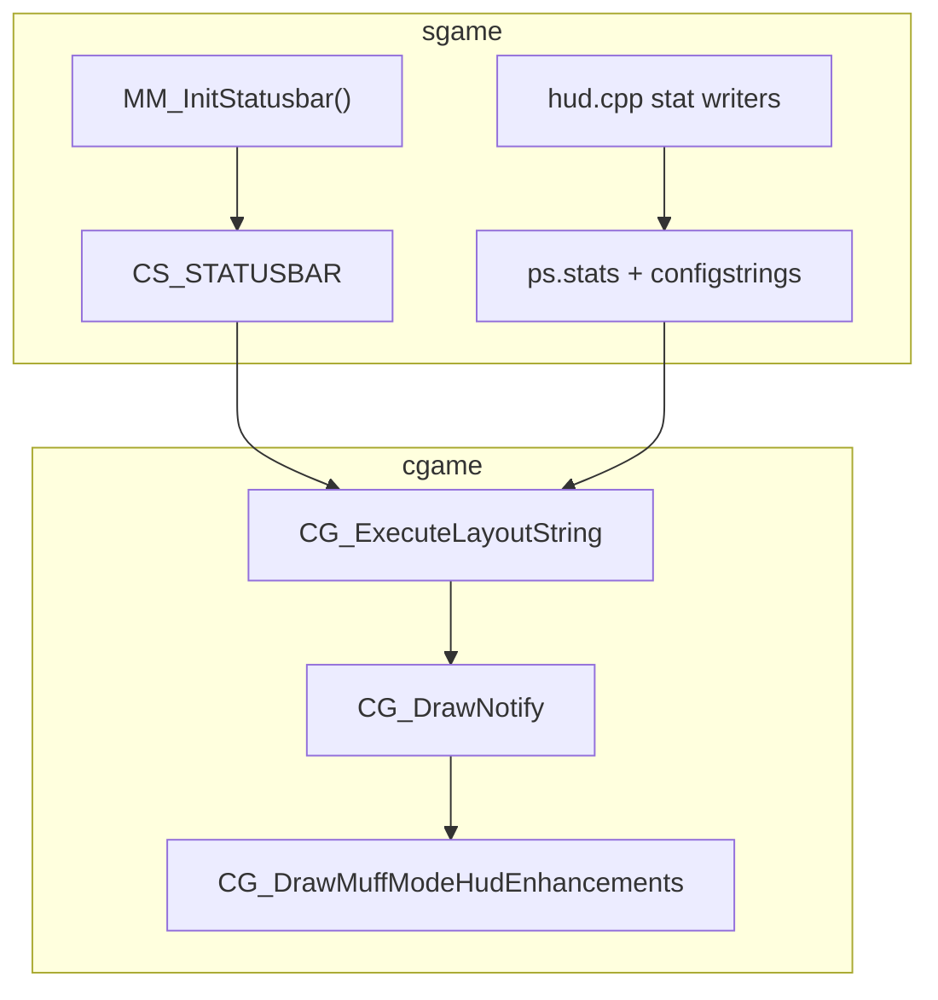

# HUD architecture

MuffMode ships one `game_x64.dll` with both sgame and cgame, but **remote clients render the HUD using their locally installed DLL**. The server pushes layout via `CS_STATUSBAR`; each client parses it in its own cgame (`CG_ExecuteLayoutString`).

## Two layers

| Layer | Owner | Contract | Stock Q2RE client | MuffMode-installed client |
|-------|-------|----------|-------------------|---------------------------|
| **Vanilla base** | sgame | `CS_STATUSBAR` + `ps.stats[]` + configstrings | Must parse and draw correctly | Same |
| **MM client enhancement** | cgame | Optional redraw / alignment after base parse | Not present | Adds polish on top |

**Policy:** New HUD features land in the vanilla base first unless they require a token or draw behaviour stock Q2RE lacks. Enhancements belong in cgame and must not be required for information to appear.

The layout string + stats must be **self-sufficient** for stock clients. MM cgame may redraw on top; it does not replace layout tokens.

## Draw order (deathmatch)

## Vanilla-safe layout tokens

Only tokens implemented in stock `Vanilla/cg_screen.cpp` may appear in emitted layouts. See `MM_STATUSBAR_VANILLA_TOKENS` in `mm_hud_stat_contracts.h`.

### Forbidden tokens

| Token | Why |
|-------|-----|
| `ifbit` | Skipped by stock parser; paired `endif` from `endifstat()` triggers `Com_Error("endif without matching if")` |

Use `ifstat` + configstrings instead (same pattern as `STAT_WARMUP_NOTICE` / `STAT_ROUND_NUMBER`).

## Key stats (vanilla base)

| Stat | Writer | Layout consumer | Notes |
|------|--------|-----------------|-------|
| `STAT_MATCH_STATE` | `hud.cpp` / match | `xv 0 yb -78 stat_string` | Match phase label (`WARMUP`, timer, etc.) |
| `STAT_WARMUP_NOTICE` | unused | `xv 0 yb -90` | Reserved; warmup/ready guidance is centerprint (menu-bind band) |
| `STAT_GAMETYPE_HUD` | `hud.cpp` | top-right `loc_stat_rstring` | Gametype / limit label |
| `STAT_RULESET_HUD` | `hud.cpp` | top-right | Ruleset or capturelimit |
| `STAT_ROUND_NUMBER` | `hud.cpp` | top-right | Round progress via `CONFIG_ROUND_PROGRESS` |
| `STAT_CENTER_LINE` | `hud.cpp` | `xv 0 yt 26` | Duel pic; CA/RR/LMS POV text |
| `STAT_COUNTDOWN` | match | `yb -256 num` | Layout position (same on all clients) |
| `STAT_HORDE_REMAINING` | `hud.cpp` | Horde right stack `num` | Horde only |
| `STAT_ARENA_ROLE` | `hud.cpp` | Strike top-right or CA centre yt 48 | Per-client via `CONFIG_POV_CENTER_POOL` |
| `STAT_MINISCORE_*` | `hud.cpp` | bottom corners | Team / FFA miniscore |

Full contract comments: `src/sgame/muffmode/mm_hud_stat_contracts.h`.

## MM client enhancement (`CG_DrawMuffModeHudEnhancements`)

Hook after notify; **currently empty**. Timer, warmup, centre line, and countdown are drawn only via `CG_ExecuteLayoutString` so stock and MM clients match pixel-for-pixel.

Future MM-only polish (team border, etc.) belongs here and must not replace layout tokens.

## Validation

- **Runtime:** `MM_InitStatusbar()` errors if layout contains banned tokens (e.g. `ifbit`).
- **CI:** Host tests assert layout whitelist logic and banned-token detection via `MM_StatusbarLayoutUsesOnlyVanillaTokens`.

## Verification (stock client)

1. Restore vanilla Q2RE `game_x64.dll`.
2. Connect to a MuffMode server.
3. Confirm no `Com_Error` / client drop on HUD draw.
4. Spot-check FFA, CA, Strike, Horde, LMS, RR — vitals, miniscore, timer (bottom-left), gametype stack, arena labels.
